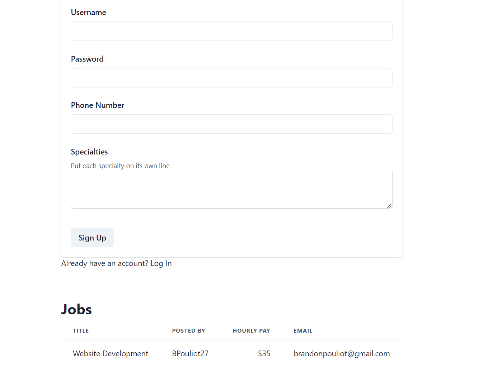

# Gighub

# Built with

-React
-Tailwind
-Vite
-Eslint
-Postcss
-Prettier
-BCrypt
-Cors
-Express
-Graphql
-Mongoose
-Nodemon
-Concurrently

# Description

Gighub is a job board application where clients can post job listings with a title and description, as well as hourly pay. Another feature is that contractors can have certain specialties that can be listed, as well as reviews for each contractor to see if they would be a good fit.

# Table of Contents
-[Gighub](#gighub)
-[Built With](#built-with)
-[Description](#description)
-[Installation](#installation)
-[Usage](#usage)
-[Visuals](#visuals)
-[Tests](#tests)
-[Credits](#credits)
-[References](#references)
-[License](#license)


# Installation

-`git clone https://github.com/KevinKiely/Gighub.git`
-**cd** into root of cloned project
-run `npm install` to install all dependencies
-run `npm develop`

# Usage

# Visuals




# Tests

N/A

# Credits

# References

 [Mongo Routes](https://developer.mozilla.org/en-US/docs/Learn/Server-side/Express_Nodejs/routes)
 [React](https://www.w3schools.com/whatis/whatis_react.asp)
 [Prettier](https://prettier.io/docs/en/)
 [BCrypt](https://www.npmjs.com/package/bcrypt)
 [Cors](https://developer.mozilla.org/en-US/docs/Web/HTTP/CORS)

# License

This project is covered under MIT License

<details>
  <summary>
    License Text
  </summary>

```

Copyright (c) 2024

Permission is hereby granted, free of charge, to any perOAson obtaining a copy
of this software and associated documentation files (the "Software"), to deal
in the Software without restriction, including without limitation the rights
to use, copy, modify, merge, publish, distribute, sublicense, and/or sell
copies of the Software, and to permit persons to whom the Software is
furnished to do so, subject to the following conditions:

The above copyright notice and this permission notice shall be included in all
copies or substantial portions of the Software.

THE SOFTWARE IS PROVIDED "AS IS", WITHOUT WARRANTY OF ANY KIND, EXPRESS OR
IMPLIED, INCLUDING BUT NOT LIMITED TO THE WARRANTIES OF MERCHANTABILITY,
FITNESS FOR A PARTICULAR PURPOSE AND NONINFRINGEMENT. IN NO EVENT SHALL THE
AUTHORS OR COPYRIGHT HOLDERS BE LIABLE FOR ANY CLAIM, DAMAGES OR OTHER
LIABILITY, WHETHER IN AN ACTION OF CONTRACT, TORT OR OTHERWISE, ARISING FROM,
OUT OF OR IN CONNECTION WITH THE SOFTWARE OR THE USE OR OTHER DEALINGS IN THE
SOFTWARE.

```

</details>